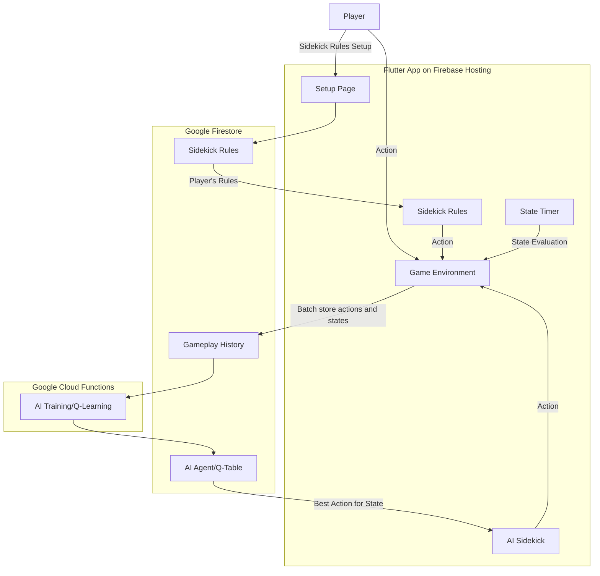

# Black Death

An educational game built in Flutter about climate change and ways to prevent it

This game introduces the concepts:
1. A rule-based sidekick that you can configure to play along/for you
2. Games played cotribute to a central AI, which gets better (in solving the problem) with each game played

## Hosted

[bucky.games](https://bucky.games)

## Architecture

## Development

Pre-requisite:

- [Flutter](https://flutter.dev/docs/get-started/install) which comes with Dart
- [FlutterFire](https://firebase.flutter.dev/docs/overview#installation) to create lib/firebase_options.dart for connecting with your firebase project

To run the app in debug mode:

    flutter run

## Deployment (Firebase Hosting)

Pre-requisite:

- [Firebase CLI](https://firebase.google.com/docs/cli)

First deployment:

    flutter create --platforms=web .
    flutter build web

    firebase login
    firebase init
    firebase deploy

Subsequent deployments:

    flutter build web
    firebase deploy

## Upcoming Updates

- AI Sidekick to handle states not seen before
- Environment to be realistic (e.g. renewables maintenance/replacement)